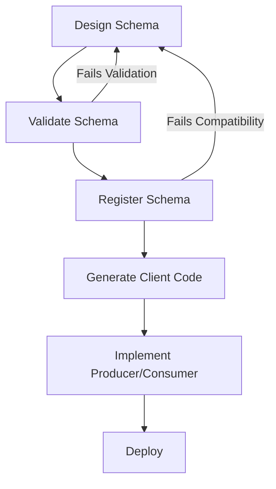

# Event Schema Design

## Introduction
This document provides guidelines and standards for designing event schemas in the Event-Driven Architecture. Properly designed event schemas are crucial for ensuring compatibility, maintainability, and evolvability of the platform's event-driven systems.

## Schema Registry

All event schemas must be registered in the centralized Schema Registry, which serves as the source of truth for event formats across the platform.

### Registry Overview

The platform uses Confluent Schema Registry to manage and evolve event schemas:

- **Central Repository**: Single source of truth for all event schemas
- **Schema Validation**: Runtime validation of event compliance with registered schemas
- **Compatibility Checks**: Enforces compatibility rules during schema evolution
- **Schema Versioning**: Maintains history of all schema versions
- **Client Integration**: Automatic client serialization and deserialization

### Schema Registration Process



To register a new schema:

1. Design the schema according to the guidelines in this document
2. Validate the schema against our standards
3. Register the schema in the Schema Registry:

```bash
# Register a new schema
curl -X POST -H "Content-Type: application/vnd.schemaregistry.v1+json" \
  --data '{"schema": "{\"type\":\"record\",\"name\":\"PatientCreated\",\"namespace\":\"com.covermymeds.events.patient\",\"fields\":[...]}"}' \
  https://schema-registry.cmm.internal/subjects/patient-events-value/versions
```

4. Generate client code if needed
5. Implement producers and consumers using the registered schema
6. Deploy and monitor

## Schema Formats

### Supported Formats

The platform supports the following schema formats:

| Format | Use Case | Strengths | Weaknesses |
|--------|----------|-----------|------------|
| Apache Avro | Default format for all events | Strong typing, compact binary format, built-in schema evolution | Requires schema registry, less human-readable |
| JSON Schema | Legacy systems, external partners | Human-readable, widely supported | Larger payload size, weaker typing |
| Protocol Buffers | Performance-critical systems | Very compact, high performance | Less flexible evolution, steeper learning curve |

### Preferred Format: Apache Avro

Avro is the preferred schema format for platform events due to its:

- **Schema Evolution Support**: Built-in compatibility rules
- **Compact Binary Format**: Efficient serialization
- **Rich Type System**: Supports complex data structures
- **Language Neutrality**: Works with multiple programming languages
- **Self-Describing**: Schema included in binary format

Example Avro schema for a patient creation event:

```json
{
  "type": "record",
  "name": "PatientCreated",
  "namespace": "com.covermymeds.events.patient",
  "doc": "Event emitted when a new patient record is created",
  "fields": [
    {
      "name": "metadata",
      "type": {
        "type": "record",
        "name": "EventMetadata",
        "fields": [
          {"name": "eventId", "type": "string", "doc": "Unique identifier for this event instance"},
          {"name": "eventType", "type": "string", "doc": "Type of the event, format: domain.entity.action"},
          {"name": "eventSource", "type": "string", "doc": "System or component that generated the event"},
          {"name": "correlationId", "type": "string", "doc": "ID linking related events across services"},
          {"name": "causationId", "type": ["null", "string"], "default": null, "doc": "ID of the event that caused this event"},
          {"name": "timestamp", "type": "long", "doc": "Unix epoch timestamp in milliseconds when the event occurred"},
          {"name": "version", "type": "string", "doc": "Schema version of this event type"}
        ]
      }
    },
    {
      "name": "patientId",
      "type": "string",
      "doc": "Unique identifier for the patient"
    },
    {
      "name": "firstName",
      "type": "string",
      "doc": "Patient's first name"
    },
    {
      "name": "lastName",
      "type": "string",
      "doc": "Patient's last name"
    },
    {
      "name": "dateOfBirth",
      "type": "string",
      "doc": "Patient's date of birth in ISO-8601 format (YYYY-MM-DD)"
    },
    {
      "name": "gender",
      "type": ["null", "string"],
      "default": null,
      "doc": "Patient's gender"
    },
    {
      "name": "address",
      "type": ["null", {
        "type": "record",
        "name": "Address",
        "fields": [
          {"name": "street", "type": "string"},
          {"name": "city", "type": "string"},
          {"name": "state", "type": "string"},
          {"name": "postalCode", "type": "string"},
          {"name": "country", "type": {"type": "string", "default": "US"}}
        ]
      }],
      "default": null,
      "doc": "Patient's address"
    },
    {
      "name": "phoneNumber",
      "type": ["null", "string"],
      "default": null,
      "doc": "Patient's phone number"
    },
    {
      "name": "email",
      "type": ["null", "string"],
      "default": null,
      "doc": "Patient's email address"
    },
    {
      "name": "createdBy",
      "type": "string",
      "doc": "Identifier for the user or system that created the patient record"
    },
    {
      "name": "createdAt",
      "type": "string",
      "doc": "ISO-8601 timestamp when the patient record was created"
    }
  ]
}
```

## Schema Design Principles

### 1. Clear and Explicit Intent

Event schemas should clearly communicate their purpose and content:

- **Descriptive Names**: Use clear, specific schema and field names
- **Documentation**: Include documentation for all schemas and fields
- **Business Terminology**: Use domain-specific language matching business concepts
- **Explicit Types**: Be explicit about field types and constraints

### 2. Forward and Backward Compatibility

Design schemas for evolution from the start:

- **Backward Compatibility**: New schema versions can read data written with old schemas
- **Forward Compatibility**: Old schema versions can read data written with new schemas
- **Compatible Changes**:
  - Adding optional fields
  - Adding fields with default values
  - Removing a field that had a default value
- **Incompatible Changes** (Avoid These):
  - Removing a field without a default value
  - Changing a field's type
  - Renaming fields
  - Changing a field from optional to required

### 3. Consistent Structure

Maintain consistent structures across related event schemas:

- **Common Envelope**: Use standardized envelope structure for all events
- **Consistent Naming**: Use consistent field names for similar concepts
- **Reusable Types**: Define and reuse common types across schemas
- **Consistent Versioning**: Apply versioning consistently across all schemas

### 4. Healthcare Data Standards

Align with healthcare data standards when applicable:

- **FHIR Alignment**: Use FHIR-compatible data structures for healthcare data
- **Coding Systems**: Use standard coding systems (SNOMED CT, RxNorm, LOINC, etc.)
- **Date/Time Format**: Use ISO-8601 for all date and time fields
- **Identifiers**: Follow healthcare identifier standards (NPI, NCPDP, etc.)

### 5. Right-Sized Events

Design events with appropriate granularity:

- **Focused Purpose**: Each event should represent a single logical change
- **Complete Context**: Include enough context to be useful without being excessive
- **Payload Size**: Keep event size reasonable (< 1MB is a good rule of thumb)
- **Avoid Redundancy**: Don't duplicate data unnecessarily

## Schema Evolution

### Compatibility Types

Schema Registry supports different compatibility modes:

| Mode | Description | When to Use |
|------|-------------|------------|
| BACKWARD | New schema can read data written with old schema | Default - most flexible approach |
| FORWARD | Old schema can read data written with new schema | When consumers update slowly |
| FULL | Both backward and forward compatible | Maximum compatibility |
| NONE | No compatibility checking | Emergency situations only |

Configure compatibility at the subject or global level:

```bash
# Set compatibility mode for a specific subject
curl -X PUT -H "Content-Type: application/vnd.schemaregistry.v1+json" \
  --data '{"compatibility": "BACKWARD"}' \
  https://schema-registry.cmm.internal/config/patient-events-value
```

### Evolution Strategies

Best practices for evolving schemas:

1. **Default Values**: Always provide default values for new fields
2. **Versioning**: Include schema version in the event metadata
3. **Optional Fields**: Make new fields optional (nullable)
4. **Field Deprecation**: Mark fields as deprecated before removal
5. **Semantic Versioning**: Use semantic versioning for schema versions
   - Major version: Breaking changes
   - Minor version: Non-breaking additions
   - Patch version: Documentation updates

Example of schema evolution:

```json
// Original schema (v1.0.0)
{
  "type": "record",
  "name": "MedicationPrescribed",
  "namespace": "com.covermymeds.events.medication",
  "fields": [
    // Metadata field omitted for brevity
    {
      "name": "prescriptionId",
      "type": "string"
    },
    {
      "name": "medicationId",
      "type": "string"
    },
    {
      "name": "patientId",
      "type": "string"
    },
    {
      "name": "prescriberId",
      "type": "string"
    }
  ]
}

// Evolved schema (v1.1.0)
{
  "type": "record",
  "name": "MedicationPrescribed",
  "namespace": "com.covermymeds.events.medication",
  "fields": [
    // Metadata field omitted for brevity
    {
      "name": "prescriptionId",
      "type": "string"
    },
    {
      "name": "medicationId",
      "type": "string"
    },
    {
      "name": "patientId",
      "type": "string"
    },
    {
      "name": "prescriberId",
      "type": "string"
    },
    // New fields added with defaults for backward compatibility
    {
      "name": "quantity",
      "type": ["null", "int"],
      "default": null
    },
    {
      "name": "daysSupply",
      "type": ["null", "int"],
      "default": null
    },
    {
      "name": "instructions",
      "type": ["null", "string"],
      "default": null
    }
  ]
}
```

## Topic and Schema Naming

### Topic Naming Convention

Event topics should follow a consistent naming pattern:

```
[domain].[entity].[optional-qualifier]
```

Examples:
- `patient.record` - Patient record events
- `medication.prescription` - Medication prescription events
- `priorauth.request` - Prior authorization request events
- `payment.claim.submitted` - Payment claim submission events

### Schema Subject Naming Convention

Schema subjects should match their topic names with a suffix indicating value or key:

```
[topic-name]-value
[topic-name]-key
```

Examples:
- `patient.record-value` - Value schema for patient record events
- `medication.prescription-value` - Value schema for medication prescription events
- `priorauth.request-key` - Key schema for prior authorization request events

### Schema Names

Use PascalCase for record names, with the action as a suffix:

```
[Entity][Action]
```

Examples:
- `PatientCreated`
- `MedicationPrescribed`
- `PriorAuthApproved`

## Common Schema Patterns

### Standard FHIR Resource Events

Example of a FHIR-aligned patient event schema:

```json
{
  "type": "record",
  "name": "PatientResourceEvent",
  "namespace": "com.covermymeds.events.fhir",
  "fields": [
    // Metadata field omitted for brevity
    {
      "name": "resourceType",
      "type": {
        "type": "enum",
        "name": "FhirResourceType",
        "symbols": ["Patient", "Practitioner", "Organization", "MedicationRequest", ...]
      }
    },
    {
      "name": "operation",
      "type": {
        "type": "enum",
        "name": "FhirOperation",
        "symbols": ["create", "update", "delete"]
      }
    },
    {
      "name": "resource",
      "type": "string",
      "doc": "JSON string representation of the FHIR resource"
    },
    {
      "name": "resourceId",
      "type": "string"
    },
    {
      "name": "versionId",
      "type": "string"
    }
  ]
}
```

### Standard Envelope Pattern

Example of the standard envelope pattern:

```json
{
  "type": "record",
  "name": "EventEnvelope",
  "namespace": "com.covermymeds.events.common",
  "fields": [
    {
      "name": "metadata",
      "type": {
        "type": "record",
        "name": "EventMetadata",
        "fields": [
          {"name": "eventId", "type": "string"},
          {"name": "eventType", "type": "string"},
          {"name": "eventSource", "type": "string"},
          {"name": "correlationId", "type": "string"},
          {"name": "causationId", "type": ["null", "string"], "default": null},
          {"name": "timestamp", "type": "long"},
          {"name": "version", "type": "string"},
          {"name": "traceId", "type": ["null", "string"], "default": null}
        ]
      }
    },
    {
      "name": "payload",
      "type": "bytes",
      "doc": "The specific event payload schema, serialized as Avro binary"
    }
  ]
}
```

### Command Event Pattern

For command-based patterns:

```json
{
  "type": "record",
  "name": "CreatePriorAuthCommand",
  "namespace": "com.covermymeds.commands.priorauth",
  "fields": [
    {
      "name": "commandId",
      "type": "string",
      "doc": "Unique identifier for this command"
    },
    {
      "name": "commandType",
      "type": "string",
      "doc": "Type of the command, e.g., 'priorauth.create'"
    },
    {
      "name": "timestamp",
      "type": "long",
      "doc": "When the command was issued"
    },
    {
      "name": "correlationId",
      "type": "string",
      "doc": "ID for correlating related commands and events"
    },
    {
      "name": "patientId",
      "type": "string"
    },
    {
      "name": "prescriptionId",
      "type": "string"
    },
    {
      "name": "medication",
      "type": {
        "type": "record",
        "name": "Medication",
        "fields": [
          {"name": "ndc", "type": "string"},
          {"name": "name", "type": "string"},
          {"name": "quantity", "type": "int"},
          {"name": "daysSupply", "type": "int"}
        ]
      }
    },
    {
      "name": "providerId",
      "type": "string"
    },
    {
      "name": "payerId",
      "type": "string"
    }
  ]
}
```

## Implementation Examples

### TypeScript Producer with Avro Schema

```typescript
import { Kafka } from 'kafkajs';
import { SchemaRegistry } from '@kafkajs/confluent-schema-registry';

// Initialize Kafka and Schema Registry clients
const kafka = new Kafka({
  clientId: 'patient-service',
  brokers: ['kafka.cmm.internal:9092'],
  // Authentication and SSL config
});

const registry = new SchemaRegistry({
  host: 'https://schema-registry.cmm.internal',
  // Authentication config
});

const producer = kafka.producer();

// Function to publish a patient created event
async function publishPatientCreatedEvent(patient: any): Promise<void> {
  await producer.connect();
  
  // Create event with standard envelope
  const event = {
    metadata: {
      eventId: uuidv4(),
      eventType: 'patient.record.created',
      eventSource: 'patient-service',
      correlationId: uuidv4(),
      timestamp: Date.now(),
      version: '1.0.0'
    },
    patientId: patient.id,
    firstName: patient.firstName,
    lastName: patient.lastName,
    dateOfBirth: patient.dateOfBirth,
    gender: patient.gender || null,
    address: patient.address || null,
    phoneNumber: patient.phoneNumber || null,
    email: patient.email || null,
    createdBy: patient.createdBy,
    createdAt: new Date().toISOString()
  };
  
  try {
    // Get schema ID by subject and encode event
    const schemaId = await registry.getLatestSchemaId('patient.record-value');
    const encodedEvent = await registry.encode(schemaId, event);
    
    // Send event to Kafka
    await producer.send({
      topic: 'patient.record',
      messages: [
        {
          key: patient.id,
          value: encodedEvent
        }
      ]
    });
    
    console.log(`Published patient created event for ${patient.id}`);
  } catch (error) {
    console.error('Error publishing patient created event:', error);
    throw error;
  } finally {
    await producer.disconnect();
  }
}
```

### Java Consumer with Avro Schema

```java
import io.confluent.kafka.serializers.KafkaAvroDeserializer;
import org.apache.kafka.clients.consumer.ConsumerConfig;
import org.apache.kafka.clients.consumer.ConsumerRecord;
import org.apache.kafka.clients.consumer.ConsumerRecords;
import org.apache.kafka.clients.consumer.KafkaConsumer;
import org.apache.kafka.common.serialization.StringDeserializer;

import java.time.Duration;
import java.util.Collections;
import java.util.Properties;

public class PatientEventConsumer {
    private final KafkaConsumer<String, GenericRecord> consumer;
    
    public PatientEventConsumer() {
        Properties props = new Properties();
        props.put(ConsumerConfig.BOOTSTRAP_SERVERS_CONFIG, "kafka.cmm.internal:9092");
        props.put(ConsumerConfig.GROUP_ID_CONFIG, "patient-indexing-service");
        props.put(ConsumerConfig.KEY_DESERIALIZER_CLASS_CONFIG, StringDeserializer.class.getName());
        props.put(ConsumerConfig.VALUE_DESERIALIZER_CLASS_CONFIG, KafkaAvroDeserializer.class.getName());
        props.put(ConsumerConfig.AUTO_OFFSET_RESET_CONFIG, "earliest");
        props.put("schema.registry.url", "https://schema-registry.cmm.internal");
        props.put("specific.avro.reader", true);
        
        // SSL and authentication properties if needed
        
        consumer = new KafkaConsumer<>(props);
    }
    
    public void subscribe() {
        consumer.subscribe(Collections.singletonList("patient.record"));
    }
    
    public void processEvents() {
        try {
            while (true) {
                ConsumerRecords<String, GenericRecord> records = consumer.poll(Duration.ofMillis(100));
                
                for (ConsumerRecord<String, GenericRecord> record : records) {
                    String patientId = record.key();
                    GenericRecord event = record.value();
                    
                    // Extract event metadata
                    GenericRecord metadata = (GenericRecord) event.get("metadata");
                    String eventType = metadata.get("eventType").toString();
                    
                    // Process based on event type
                    if (eventType.equals("patient.record.created")) {
                        handlePatientCreated(patientId, event);
                    } else if (eventType.equals("patient.record.updated")) {
                        handlePatientUpdated(patientId, event);
                    }
                    
                    // Commit offsets after processing
                    consumer.commitSync();
                }
            }
        } finally {
            consumer.close();
        }
    }
    
    private void handlePatientCreated(String patientId, GenericRecord event) {
        // Extract patient data from event
        String firstName = event.get("firstName").toString();
        String lastName = event.get("lastName").toString();
        String dateOfBirth = event.get("dateOfBirth").toString();
        
        // Process the patient creation event
        System.out.println("Processing patient created event: " + patientId);
        
        // Index patient data or update database, etc.
    }
    
    private void handlePatientUpdated(String patientId, GenericRecord event) {
        // Process patient update
    }
    
    public static void main(String[] args) {
        PatientEventConsumer consumer = new PatientEventConsumer();
        consumer.subscribe();
        consumer.processEvents();
    }
}
```

## Schema Validation and Testing

### Schema Validation Tools

Tools for validating Avro schemas:

1. **avro-schema-validator**: Command-line tool for validating Avro schemas
2. **avro-tools**: Official Avro tools for schema validation and manipulation
3. **Schema Registry compatibility checks**: Test compatibility before registration

Example validation:

```bash
# Validate schema syntax
java -jar avro-tools.jar validate schema patientCreated.avsc

# Check compatibility with Schema Registry
curl -X POST -H "Content-Type: application/vnd.schemaregistry.v1+json" \
  --data '{"schema": "{\"type\":\"record\",\"name\":\"PatientCreated\",...}"}' \
  https://schema-registry.cmm.internal/compatibility/subjects/patient.record-value/versions/latest
```

### Schema Testing Strategies

Best practices for testing event schemas:

1. **Unit Testing**: Test serialization and deserialization in code
2. **Schema Evolution Testing**: Test backward and forward compatibility 
3. **Integration Testing**: Test end-to-end event flow with actual Kafka
4. **Consumer Contract Testing**: Verify consumer can process events
5. **Schema Registry Validation**: Validate against Schema Registry before deployment

Example unit test for schema compatibility:

```typescript
import { avroToJSON, jsonToAvro } from 'avsc';
import { readFileSync } from 'fs';

describe('PatientCreated Schema Compatibility', () => {
  const oldSchema = JSON.parse(readFileSync('./schemas/v1.0.0/patientCreated.avsc', 'utf8'));
  const newSchema = JSON.parse(readFileSync('./schemas/v1.1.0/patientCreated.avsc', 'utf8'));
  
  it('should deserialize old data with new schema (backward compatibility)', () => {
    // Sample data using old schema
    const oldData = {
      metadata: {
        eventId: '123',
        eventType: 'patient.record.created',
        eventSource: 'test',
        correlationId: '456',
        timestamp: Date.now(),
        version: '1.0.0'
      },
      patientId: 'P123',
      firstName: 'John',
      lastName: 'Doe',
      dateOfBirth: '1980-01-01',
      createdBy: 'test',
      createdAt: '2023-01-01T00:00:00Z'
    };
    
    // Serialize with old schema
    const serialized = jsonToAvro(oldSchema, oldData);
    
    // Deserialize with new schema
    const deserialized = avroToJSON(newSchema, serialized);
    
    // Verify core fields match
    expect(deserialized.patientId).toBe(oldData.patientId);
    expect(deserialized.firstName).toBe(oldData.firstName);
    expect(deserialized.lastName).toBe(oldData.lastName);
    
    // New fields should have default values
    expect(deserialized.address).toBeNull();
    expect(deserialized.phoneNumber).toBeNull();
    expect(deserialized.email).toBeNull();
  });
});
```

## Related Documentation
- [Event-Driven Architecture Overview](../01-overview/overview.md)
- [EDA Key Concepts](../01-overview/key-concepts.md)
- [Event Patterns](./event-patterns.md)
- [Integration Patterns](../01-overview/integration-points.md)