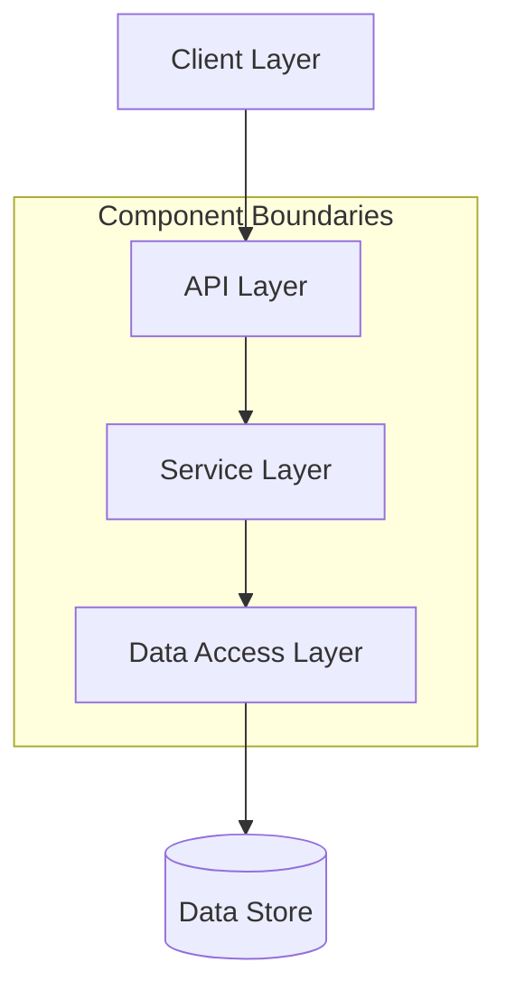
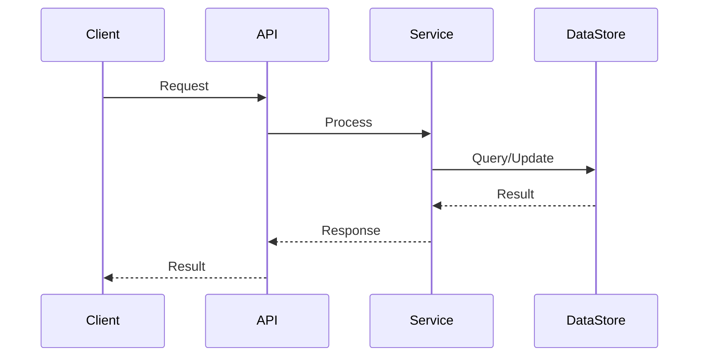
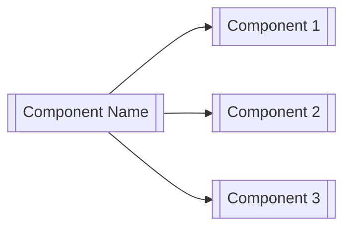

# [Component Name] Architecture

## Introduction

[Detailed description of the component's architecture, design principles, and key architectural decisions. This document focuses on the internal structure and design of the component.]

## Architectural Overview

[High-level architectural diagram and explanation of the component's structure]

## Component Structure

[Detailed breakdown of the component's internal structure, including modules, services, and their responsibilities]

### [Module/Service 1]

[Description of the module/service's purpose, responsibilities, and key interfaces]

### [Module/Service 2]

[Description of the module/service's purpose, responsibilities, and key interfaces]

### [Module/Service 3]

[Description of the module/service's purpose, responsibilities, and key interfaces]

## Data Flow

[Description of how data flows through the component, including sequence diagrams for key operations]

## Design Patterns

[Description of key design patterns used in the component]

### [Pattern 1]

[Description of the pattern and how it's applied in the component]

### [Pattern 2]

[Description of the pattern and how it's applied in the component]

## Technology Stack

[Description of the technologies used in the component]

| Layer | Technologies |
|-------|---------------|
| Frontend | [Technologies used] |
| API | [Technologies used] |
| Service | [Technologies used] |
| Data | [Technologies used] |
| Infrastructure | [Technologies used] |

## Integration Architecture

[Description of how the component integrates with other components in the CMM Reference Architecture]

### Integration with [Component 1]

[Detailed description of integration with Component 1, including interfaces, protocols, and data formats]

### Integration with [Component 2]

[Detailed description of integration with Component 2, including interfaces, protocols, and data formats]

## Scalability and Performance

[Description of how the component handles scalability and performance requirements]

### Scalability Approach

[Description of the scalability approach, including horizontal/vertical scaling strategies]

### Performance Considerations

[Description of performance considerations, including caching, optimization strategies, and expected performance characteristics]

## Security Architecture

[Description of the component's security architecture]

### Authentication and Authorization

[Description of how authentication and authorization are implemented]

### Data Protection

[Description of how sensitive data is protected]

### Audit and Compliance

[Description of audit and compliance mechanisms]

## Resilience and Fault Tolerance

[Description of how the component handles failures and ensures resilience]

### Error Handling

[Description of error handling strategies]

### Circuit Breaking

[Description of circuit breaking patterns if applicable]

### Retry and Backoff Strategies

[Description of retry and backoff strategies if applicable]

## Deployment Architecture

[High-level description of deployment architecture, with reference to detailed deployment documentation]

## Key Architectural Decisions

[Summary of key architectural decisions and their rationale]

| Decision | Alternatives Considered | Rationale |
|----------|-------------------------|------------|
| [Decision 1] | [Alternatives] | [Rationale] |
| [Decision 2] | [Alternatives] | [Rationale] |
| [Decision 3] | [Alternatives] | [Rationale] |

## Related Documentation

- [Overview](./overview.md)
- [Key Concepts](./key-concepts.md)
- [Core APIs](../02-core-functionality/core-apis.md)
- [Deployment Guide](../05-operations/deployment.md)
