# [Component Name] Audit and Compliance

## Introduction

This document outlines the audit and compliance framework for the [Component Name], with a specific focus on IT General Controls (ITGCs) that support financial reporting and regulatory compliance. It describes the control objectives, control activities, audit logging mechanisms, and compliance monitoring approaches implemented in the component.

## IT General Controls (ITGCs)

IT General Controls are the foundation of the control environment for [Component Name]. These controls ensure the integrity, availability, and confidentiality of data and systems that support financial reporting and regulatory compliance.

### Control Objectives

| Control Objective | Description | Regulatory Relevance |
|-------------------|-------------|----------------------|
| System Access Security | Ensure that access to systems and data is appropriately restricted to authorized users | SOX 404, HIPAA Security Rule, GDPR Article 32 |
| Change Management | Ensure that changes to systems and data are properly authorized, tested, and implemented | SOX 404, HIPAA Security Rule, FDA 21 CFR Part 11 |
| System Operations | Ensure that systems are operating as intended and that issues are identified and resolved in a timely manner | SOX 404, HIPAA Security Rule |
| Data Backup and Recovery | Ensure that data is backed up regularly and can be recovered in case of failure | SOX 404, HIPAA Security Rule, GDPR Article 32 |

### Segregation of Duties

Segregation of duties is a critical aspect of IT general controls that prevents any single individual from having complete control over a process, reducing the risk of fraud and errors.

| Role | Responsibilities | Segregated From |
|------|-----------------|------------------|
| Developer | Code development, unit testing | Production deployment, user access management |
| DevOps Engineer | CI/CD pipeline management, infrastructure provisioning | Code development, user access management |
| System Administrator | System configuration, monitoring | Code development, change approval |
| Security Administrator | User access management, security monitoring | Code development, change approval |
| Change Manager | Change request review and approval | Code development, implementation |

### Change Management Controls

Change management controls ensure that changes to the [Component Name] are properly authorized, tested, and implemented.

#### Control Activities

1. **Change Request Process**
   - All changes must be documented in a change request
   - Change requests must include justification, impact assessment, and rollback plan
   - Changes must be categorized by risk level (low, medium, high)

2. **Change Approval**
   - Low-risk changes require approval from the team lead
   - Medium-risk changes require approval from the change advisory board
   - High-risk changes require approval from the change advisory board and IT management

3. **Testing Requirements**
   - All changes must be tested in a non-production environment
   - Test plans must be documented and test results recorded
   - User acceptance testing is required for changes affecting user interfaces

4. **Implementation Controls**
   - Changes must be implemented during approved change windows
   - Implementation must follow the documented implementation plan
   - Post-implementation verification must be performed

5. **Emergency Change Process**
   - Emergency changes must follow an expedited approval process
   - Emergency changes must be documented and reviewed post-implementation
   - Emergency changes must be limited to those necessary to resolve the emergency

```typescript
// Example: Change management audit log entry
interface ChangeAuditLog {
  changeId: string;
  requestor: string;
  approver: string;
  changeType: 'normal' | 'emergency';
  riskLevel: 'low' | 'medium' | 'high';
  description: string;
  justification: string;
  approvalDate: string;
  implementationDate: string;
  implementedBy: string;
  verificationResult: 'success' | 'failure';
  verifiedBy: string;
  verificationDate: string;
}

// Example: Logging a change
function logChange(change: ChangeAuditLog): void {
  // Log to secure audit log system
  auditLogger.logEvent({
    eventType: 'change_management',
    eventData: change,
    timestamp: new Date().toISOString(),
    source: 'change_management_system'
  });
}
```

### System Access Controls

System access controls ensure that access to the [Component Name] is appropriately restricted to authorized users.

#### Control Activities

1. **User Access Provisioning**
   - Access requests must be formally documented and approved
   - Access must be granted based on the principle of least privilege
   - Access must be reviewed and recertified periodically

2. **Authentication Controls**
   - Multi-factor authentication is required for all privileged access
   - Password complexity and rotation policies are enforced
   - Failed login attempts are monitored and locked after threshold

3. **Authorization Controls**
   - Role-based access control (RBAC) is implemented
   - Privileged access is restricted and monitored
   - Temporary access is time-limited and automatically revoked

4. **Access Termination**
   - Access is promptly revoked upon termination or role change
   - Terminated access is verified and documented
   - Shared accounts are prohibited

```typescript
// Example: Access control audit log entry
interface AccessAuditLog {
  userId: string;
  action: 'login' | 'logout' | 'access_granted' | 'access_revoked' | 'access_denied';
  resource: string;
  resourceType: string;
  timestamp: string;
  ipAddress: string;
  userAgent: string;
  result: 'success' | 'failure';
  failureReason?: string;
}

// Example: Logging access events
function logAccessEvent(event: AccessAuditLog): void {
  // Log to secure audit log system
  auditLogger.logEvent({
    eventType: 'access_control',
    eventData: event,
    timestamp: new Date().toISOString(),
    source: 'access_control_system'
  });
}
```

### IT Operations Controls

IT operations controls ensure that the [Component Name] is operating as intended and that issues are identified and resolved in a timely manner.

#### Control Activities

1. **Monitoring and Alerting**
   - System performance and availability are continuously monitored
   - Alerts are configured for critical thresholds and events
   - Incidents are logged and tracked to resolution

2. **Backup and Recovery**
   - Data is backed up according to defined schedules
   - Backups are tested periodically to ensure recoverability
   - Disaster recovery procedures are documented and tested

3. **Patch Management**
   - Security patches are applied in a timely manner
   - Patches are tested before deployment to production
   - Patch deployment is documented and verified

4. **Capacity Management**
   - System capacity is monitored and planned
   - Capacity thresholds are defined and monitored
   - Capacity upgrades are planned and implemented proactively

```typescript
// Example: Operations audit log entry
interface OperationsAuditLog {
  eventType: 'backup' | 'recovery' | 'patch' | 'incident' | 'capacity';
  description: string;
  performedBy: string;
  timestamp: string;
  result: 'success' | 'failure';
  details: Record<string, any>;
}

// Example: Logging operations events
function logOperationsEvent(event: OperationsAuditLog): void {
  // Log to secure audit log system
  auditLogger.logEvent({
    eventType: 'it_operations',
    eventData: event,
    timestamp: new Date().toISOString(),
    source: 'operations_management_system'
  });
}
```

## Audit Framework

### Audit Logging Architecture

[Component Name] implements a comprehensive audit logging architecture that captures all security-relevant events and ensures the integrity and availability of audit logs.

```mermaid
graph TD
    A[Component Events] -->|Generate| B[Audit Events]
    B -->|Collect| C[Audit Collector]
    C -->|Process| D[Audit Processor]
    D -->|Store| E[(Audit Repository)]
    D -->|Alert| F[Alerting System]
    E -->|Archive| G[Long-term Archive]
    E -->|Report| H[Audit Reporting]
    
    classDef component fill:#00426A,stroke:#333,stroke-width:1px;
    classDef external fill:#E70665,stroke:#333,stroke-width:1px;
    classDef database fill:#FF8F1D,stroke:#333,stroke-width:1px;
    classDef security fill:#1E91D6,stroke:#333,stroke-width:1px;
    
    class A,B,C,D component;
    class F,H external;
    class E,G database;
```



### Auditable Event Types

| Event Category | Event Types | Control Relevance |
|----------------|-------------|-------------------|
| Authentication | Login, logout, failed login attempts | System Access Security |
| Authorization | Access granted, access denied, privilege changes | System Access Security |
| Data Access | Read, write, delete, export | System Access Security, Data Privacy |
| Configuration | System configuration changes, security settings changes | Change Management |
| Administration | User management, role management, permission changes | System Access Security |
| System Events | System startup, shutdown, errors, warnings | System Operations |

### Audit Data Collection

Audit data is collected from multiple sources and normalized into a standard format:

```typescript
// Example: Standard audit event format
interface AuditEvent {
  eventId: string;
  eventType: string;
  eventCategory: string;
  timestamp: string;
  source: string;
  actor: {
    id: string;
    type: 'user' | 'system' | 'service';
    name: string;
  };
  action: string;
  outcome: 'success' | 'failure';
  target: {
    id: string;
    type: string;
    name: string;
  };
  details: Record<string, any>;
  controlRelevance: string[];
}

// Example: Audit event collection
class AuditCollector {
  collectEvent(event: AuditEvent): void {
    // Validate event
    this.validateEvent(event);
    
    // Enrich event with additional context
    this.enrichEvent(event);
    
    // Forward to audit processor
    this.forwardToProcessor(event);
  }
  
  private validateEvent(event: AuditEvent): void {
    // Validation logic
  }
  
  private enrichEvent(event: AuditEvent): void {
    // Enrichment logic
  }
  
  private forwardToProcessor(event: AuditEvent): void {
    // Forwarding logic
  }
}
```

### Audit Log Protection

Audit logs are protected to ensure their integrity, confidentiality, and availability:

1. **Integrity Protection**
   - Cryptographic hashing of log entries
   - Digital signatures for log files
   - Tamper-evident logging

2. **Confidentiality Protection**
   - Encryption of sensitive log data
   - Access controls on log repositories
   - Data masking for sensitive information

3. **Availability Protection**
   - Redundant log storage
   - Regular log backups
   - Log archiving for long-term retention

```typescript
// Example: Audit log protection
class AuditLogProtector {
  protectLogEntry(entry: AuditEvent): string {
    // Generate hash of the entry
    const hash = this.generateHash(entry);
    
    // Encrypt sensitive data
    const encryptedEntry = this.encryptSensitiveData(entry);
    
    // Sign the entry
    const signature = this.signEntry(encryptedEntry, hash);
    
    // Return the protected entry
    return JSON.stringify({
      entry: encryptedEntry,
      hash,
      signature
    });
  }
  
  private generateHash(entry: AuditEvent): string {
    // Hash generation logic
    return 'hash_value';
  }
  
  private encryptSensitiveData(entry: AuditEvent): AuditEvent {
    // Encryption logic
    return entry;
  }
  
  private signEntry(entry: AuditEvent, hash: string): string {
    // Digital signature logic
    return 'signature_value';
  }
}
```

## Compliance Monitoring

### Control Effectiveness Monitoring

Control effectiveness is continuously monitored to ensure that IT general controls are operating as intended:

1. **Automated Control Testing**
   - Automated tests verify control implementation
   - Tests run on a scheduled basis
   - Test results are logged and reported

2. **Control Metrics**
   - Key performance indicators (KPIs) for each control
   - Metrics are collected and analyzed
   - Trends are monitored for degradation

3. **Exception Reporting**
   - Control exceptions are logged and reported
   - Root cause analysis is performed
   - Remediation actions are tracked

```typescript
// Example: Control effectiveness monitoring
class ControlMonitor {
  monitorControl(controlId: string): ControlStatus {
    // Get control definition
    const control = this.getControlDefinition(controlId);
    
    // Run control tests
    const testResults = this.runControlTests(control);
    
    // Analyze test results
    const status = this.analyzeTestResults(testResults);
    
    // Report status
    this.reportControlStatus(controlId, status);
    
    return status;
  }
  
  private getControlDefinition(controlId: string): Control {
    // Control retrieval logic
    return { id: controlId, name: 'Control Name', tests: [] };
  }
  
  private runControlTests(control: Control): TestResult[] {
    // Test execution logic
    return [];
  }
  
  private analyzeTestResults(results: TestResult[]): ControlStatus {
    // Analysis logic
    return { effective: true, exceptions: 0, lastTested: new Date().toISOString() };
  }
  
  private reportControlStatus(controlId: string, status: ControlStatus): void {
    // Reporting logic
  }
}

interface Control {
  id: string;
  name: string;
  tests: any[];
}

interface TestResult {
  testId: string;
  result: 'pass' | 'fail';
  timestamp: string;
  details: any;
}

interface ControlStatus {
  effective: boolean;
  exceptions: number;
  lastTested: string;
}
```

### Compliance Reporting

Compliance reports are generated to demonstrate compliance with regulatory requirements:

1. **SOX 404 Reporting**
   - Control documentation
   - Control testing results
   - Remediation status

2. **HIPAA Security Rule Reporting**
   - Security risk assessment
   - Security measures implementation
   - Security incident reporting

3. **GDPR Compliance Reporting**
   - Data protection measures
   - Data subject rights fulfillment
   - Data breach notification

## Implementation Examples

### Implementing Audit Logging

```typescript
// Example: Implementing audit logging in a component
import { AuditLogger } from '@cmm/audit-framework';

class UserService {
  private auditLogger: AuditLogger;
  
  constructor() {
    this.auditLogger = new AuditLogger('user-service');
  }
  
  async createUser(userData: UserData): Promise<User> {
    try {
      // Create the user
      const user = await this.userRepository.create(userData);
      
      // Log the event
      this.auditLogger.logEvent({
        eventType: 'user_created',
        eventCategory: 'administration',
        actor: {
          id: this.currentUser.id,
          type: 'user',
          name: this.currentUser.name
        },
        action: 'create',
        outcome: 'success',
        target: {
          id: user.id,
          type: 'user',
          name: user.name
        },
        details: {
          roles: user.roles,
          department: user.department
        },
        controlRelevance: ['system_access_security']
      });
      
      return user;
    } catch (error) {
      // Log the failure
      this.auditLogger.logEvent({
        eventType: 'user_creation_failed',
        eventCategory: 'administration',
        actor: {
          id: this.currentUser.id,
          type: 'user',
          name: this.currentUser.name
        },
        action: 'create',
        outcome: 'failure',
        target: {
          id: 'N/A',
          type: 'user',
          name: userData.name
        },
        details: {
          error: error.message
        },
        controlRelevance: ['system_access_security']
      });
      
      throw error;
    }
  }
}
```

### Implementing Change Management Controls

```typescript
// Example: Implementing change management controls
import { ChangeManager } from '@cmm/change-management';

class DeploymentService {
  private changeManager: ChangeManager;
  
  constructor() {
    this.changeManager = new ChangeManager();
  }
  
  async deployRelease(releaseId: string): Promise<DeploymentResult> {
    // Get the change request
    const changeRequest = await this.changeManager.getChangeRequest(releaseId);
    
    // Verify change approval
    if (!changeRequest.approved) {
      throw new Error('Cannot deploy unapproved change');
    }
    
    // Verify change window
    if (!this.isInChangeWindow(changeRequest.scheduledWindow)) {
      throw new Error('Deployment outside of approved change window');
    }
    
    try {
      // Perform the deployment
      const result = await this.performDeployment(releaseId);
      
      // Update change request status
      await this.changeManager.updateChangeStatus(releaseId, 'implemented', {
        implementedBy: this.currentUser.id,
        implementationDate: new Date().toISOString(),
        deploymentResult: result
      });
      
      return result;
    } catch (error) {
      // Update change request status
      await this.changeManager.updateChangeStatus(releaseId, 'failed', {
        implementedBy: this.currentUser.id,
        implementationDate: new Date().toISOString(),
        error: error.message
      });
      
      // Initiate rollback if configured
      if (changeRequest.autoRollbackOnFailure) {
        await this.rollbackRelease(releaseId);
      }
      
      throw error;
    }
  }
  
  private isInChangeWindow(scheduledWindow: ChangeWindow): boolean {
    // Change window validation logic
    return true;
  }
  
  private async performDeployment(releaseId: string): Promise<DeploymentResult> {
    // Deployment logic
    return { success: true };
  }
  
  private async rollbackRelease(releaseId: string): Promise<void> {
    // Rollback logic
  }
}

interface ChangeWindow {
  start: string;
  end: string;
}

interface DeploymentResult {
  success: boolean;
  details?: any;
}
```

## Best Practices

1. **Comprehensive Audit Logging**
   - Log all security-relevant events
   - Include sufficient detail for forensic analysis
   - Ensure logs are tamper-evident

2. **Segregation of Duties**
   - Implement role-based access control
   - Separate development, testing, and production environments
   - Require multiple approvals for sensitive changes

3. **Automated Control Testing**
   - Implement automated tests for controls
   - Run tests on a regular schedule
   - Alert on control failures

4. **Documentation and Evidence**
   - Document all controls and procedures
   - Maintain evidence of control operation
   - Regularly review and update documentation

5. **Continuous Monitoring**
   - Implement real-time monitoring of control effectiveness
   - Use dashboards to visualize control status
   - Trend analysis to identify degrading controls

## Related Resources

- [Access Controls](../04-governance-compliance/access-controls.md)
- [Data Governance](../04-governance-compliance/data-governance.md)
- [Regulatory Compliance](../04-governance-compliance/regulatory-compliance.md)
- [Deployment Guide](../05-operations/deployment.md)
- [Monitoring Guide](../05-operations/monitoring.md)
