# [Component Name] Deployment Guide

## Introduction

[Overview of the deployment process for this component. Focus on the deployable objects, deployment targets, and high-level deployment workflow.]

## Deployment Options

[Description of the available deployment options, including containerized deployment, serverless deployment, etc.]

### Containerized Deployment

[Details on containerized deployment using Docker, Kubernetes, etc.]

### Serverless Deployment

[Details on serverless deployment options, if applicable]

## Prerequisites

[List of prerequisites for deploying this component]

### Hardware Requirements

| Resource | Minimum | Recommended |
|----------|---------|-------------|
| CPU | [Minimum CPU] | [Recommended CPU] |
| Memory | [Minimum Memory] | [Recommended Memory] |
| Storage | [Minimum Storage] | [Recommended Storage] |
| Network | [Minimum Network] | [Recommended Network] |

### Software Requirements

| Software | Version | Notes |
|----------|---------|-------|
| [Software 1] | [Version] | [Notes] |
| [Software 2] | [Version] | [Notes] |
| [Software 3] | [Version] | [Notes] |

### Network Requirements

[Description of network requirements, including ports, protocols, and connectivity]

| Port | Protocol | Purpose | Notes |
|------|----------|---------|-------|
| [Port] | [Protocol] | [Purpose] | [Notes] |
| [Port] | [Protocol] | [Purpose] | [Notes] |
| [Port] | [Protocol] | [Purpose] | [Notes] |

## Deployable Objects

### Primary Deployable Objects

[Component Name] produces the following deployable objects:

1. **[Deployable Object 1]**
   - [Description of the object]
   - [How it is packaged/published]
   - [What it is used for]

2. **[Deployable Object 2]**
   - [Description of the object]
   - [How it is packaged/published]
   - [What it is used for]

3. **[Deployable Object 3]**
   - [Description of the object]
   - [How it is packaged/published]
   - [What it is used for]

### Deployment Targets

| Deployable Object | Deployment Target | Update Frequency | Validation Requirements |
|-------------------|-------------------|------------------|--------------------------|
| [Object 1] | [Target] | [Frequency] | [Requirements] |
| [Object 2] | [Target] | [Frequency] | [Requirements] |
| [Object 3] | [Target] | [Frequency] | [Requirements] |

## CI/CD Pipeline

### Build Process

[Description of how deployable objects are built from source]

```mermaid
graph TD
    A[Source Code] -->|Trigger| B[Build Process]
    B --> C[Unit Tests]
    C --> D[Integration Tests]
    D --> E[Package Creation]
    E --> F[Artifact Repository]
    
    classDef component fill:#00426A,stroke:#333,stroke-width:1px;
    classDef external fill:#E70665,stroke:#333,stroke-width:1px;
    classDef database fill:#FF8F1D,stroke:#333,stroke-width:1px;
    classDef security fill:#1E91D6,stroke:#333,stroke-width:1px;
    
    class A,B,C,D component;
    class E external;
    class F database;
```



### Validation Process

[Description of how deployable objects are validated]

| Validation Type | Tools | Criteria | Handling Failures |
|----------------|-------|----------|-------------------|
| [Type 1] | [Tools] | [Criteria] | [Handling] |
| [Type 2] | [Tools] | [Criteria] | [Handling] |
| [Type 3] | [Tools] | [Criteria] | [Handling] |

### Deployment Environments

[Description of the different environments used in the deployment pipeline]

| Environment | Purpose | Access Control | Data Characteristics |
|------------|---------|---------------|----------------------|
| Development | [Purpose] | [Access Control] | [Data Characteristics] |
| Testing | [Purpose] | [Access Control] | [Data Characteristics] |
| Staging | [Purpose] | [Access Control] | [Data Characteristics] |
| Production | [Purpose] | [Access Control] | [Data Characteristics] |

### Rollback Process

[Description of how to roll back deployments if issues are detected]

1. **Automated Rollback Triggers**
   - [Trigger 1]
   - [Trigger 2]
   - [Trigger 3]

2. **Manual Rollback Process**
   - [Step 1]
   - [Step 2]
   - [Step 3]

## Deployment Process

[Step-by-step deployment instructions]

### Step 1: [First Step]

[Detailed instructions for the first step]

```bash
# Example commands for the first step
```

### Step 2: [Second Step]

[Detailed instructions for the second step]

```bash
# Example commands for the second step
```

### Step 3: [Third Step]

[Detailed instructions for the third step]

```bash
# Example commands for the third step
```

## Configuration

[Description of configuration options and how to configure the component]

### Configuration Files

[Description of configuration files, their locations, and formats]

```yaml
# Example configuration file
key1: value1
key2: value2
key3:
  - item1
  - item2
  - item3
```

### Environment Variables

[Description of environment variables used by the component]

| Variable | Description | Default | Required |
|----------|-------------|---------|----------|
| [Variable] | [Description] | [Default] | [Required] |
| [Variable] | [Description] | [Default] | [Required] |
| [Variable] | [Description] | [Default] | [Required] |

### Secrets Management

[Description of how secrets are managed]

## Deployment Verification

[Instructions for verifying that the deployment was successful]

### Health Checks

[Description of health checks and how to use them]

```bash
# Example health check command
curl -X GET http://localhost:8080/health
```

### Smoke Tests

[Description of smoke tests and how to run them]

```bash
# Example smoke test command
```

## Deployment in Different Environments

[Guidance for deploying in different environments (development, testing, production)]

### Development Environment

[Specific considerations for development environments]

### Testing Environment

[Specific considerations for testing environments]

### Production Environment

[Specific considerations for production environments]

## High Availability Deployment

[Guidance for deploying the component for high availability]

### Clustering

[Description of clustering options and configuration]

### Load Balancing

[Description of load balancing options and configuration]

### Failover

[Description of failover mechanisms and configuration]

## Deployment Automation

[Guidance for automating the deployment process]

### Infrastructure as Code

[Description of Infrastructure as Code options and examples]

```yaml
# Example Infrastructure as Code template
```

### CI/CD Integration

[Description of how to integrate deployment with CI/CD pipelines]

## Troubleshooting

[Common deployment issues and their solutions]

### Issue: [Common Issue 1]

**Symptom**: [Description of how the issue manifests]

**Solution**: [Steps to resolve the issue]

### Issue: [Common Issue 2]

**Symptom**: [Description of how the issue manifests]

**Solution**: [Steps to resolve the issue]

## Related Documentation

- [Monitoring Guide](./monitoring.md)
- [Scaling Guide](./scaling.md)
- [Maintenance Guide](./maintenance.md)
- [CI/CD Pipeline](./ci-cd-pipeline.md)
