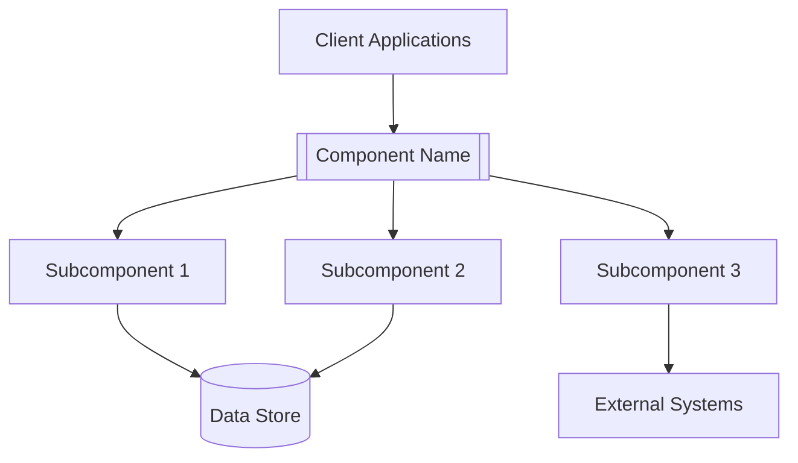

# [Component Name] Overview

## Introduction

[Brief description of the component, its purpose, and its role in the CMM Reference Architecture. Focus on the component's business value and high-level functionality.]

## Key Features

- [Feature 1]: [Brief description]
- [Feature 2]: [Brief description]
- [Feature 3]: [Brief description]
- [Feature 4]: [Brief description]

## Architecture Overview

[High-level architecture diagram and description. Focus on the component's internal structure and how it fits into the broader CMM Reference Architecture.]

## Integration Points

[Brief overview of how this component integrates with other components in the CMM Reference Architecture. Include key integration interfaces and protocols.]

### Integration with [Component 1]

[Brief description of integration with Component 1]

### Integration with [Component 2]

[Brief description of integration with Component 2]

## Use Cases

[Primary use cases for this component, focusing on healthcare-specific scenarios]

### Use Case 1: [Name]

[Brief description of use case 1]

### Use Case 2: [Name]

[Brief description of use case 2]

## Getting Started

[Brief instructions on how to get started with this component]

For detailed setup instructions, see the [Quick Start Guide](./quick-start.md).

## Related Documentation

- [Quick Start Guide](./quick-start.md)
- [Key Concepts](./key-concepts.md)
- [Architecture Details](./architecture.md)
- [Release Lifecycle](./release-lifecycle.md)
